# Домашнее задание к занятию "`GIT`" - `'Илларионов Дмитрий'`


### Инструкция по выполнению домашнего задания

   1. Сделайте `fork` данного репозитория к себе в Github и переименуйте его по названию или номеру занятия, например, https://github.com/имя-вашего-репозитория/git-hw или  https://github.com/имя-вашего-репозитория/7-1-ansible-hw).
   2. Выполните клонирование данного репозитория к себе на ПК с помощью команды `git clone`.
   3. Выполните домашнее задание и заполните у себя локально этот файл README.md:
      - впишите вверху название занятия и вашу фамилию и имя
      - в каждом задании добавьте решение в требуемом виде (текст/код/скриншоты/ссылка)
      - для корректного добавления скриншотов воспользуйтесь [инструкцией "Как вставить скриншот в шаблон с решением](https://github.com/netology-code/sys-pattern-homework/blob/main/screen-instruction.md)
      - при оформлении используйте возможности языка разметки md (коротко об этом можно посмотреть в [инструкции  по MarkDown](https://github.com/netology-code/sys-pattern-homework/blob/main/md-instruction.md))
   4. После завершения работы над домашним заданием сделайте коммит (`git commit -m "comment"`) и отправьте его на Github (`git push origin`);
   5. Для проверки домашнего задания преподавателем в личном кабинете прикрепите и отправьте ссылку на решение в виде md-файла в вашем Github.
   6. Любые вопросы по выполнению заданий спрашивайте в чате учебной группы и/или в разделе “Вопросы по заданию” в личном кабинете.
   
Желаем успехов в выполнении домашнего задания!
   
### Дополнительные материалы, которые могут быть полезны для выполнения задания

1. [Руководство по оформлению Markdown файлов](https://gist.github.com/Jekins/2bf2d0638163f1294637#Code)

---

### Задание 1

1. Зарегистрируйте аккаунт на [GitHub](https://github.com/).
`Зарегистрировал и склонировал репозиторий hw сюда:`
<https://github.com/DmitryIll/my_hw_git-gitlab_hs>

1. Создайте  **новый отдельный публичный репозиторий**. Обязательно поставьте галочку в поле «Initialize this repository with a README».
`Создал еще один репоизторий:`
<https://github.com/DmitryIll/my_repos_2.git>

2. Склонируйте репозиторий, используя https протокол `git clone ...`.
`Склонировал:`
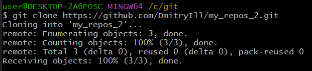

```sh
git clone https://github.com/DmitryIll/my_repos_2.git
```

3. Перейдите в каталог с клоном репозитория.

```sh
git cd my_repos_2
```
1. Произведите первоначальную настройку Git, указав своё настоящее имя и email: `git config --global user.name` и `git config --global user.email johndoe@example.com`.

`Выполнил:`
```
$ git config --global user.name DmitryIll
$ git config --global user.email dnillarionov@gmail.com
```
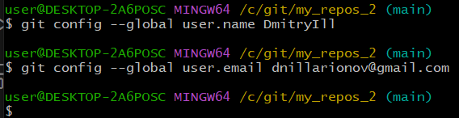

1. Выполните команду `git status` и запомните результат.

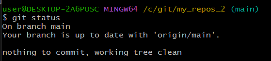

1. Отредактируйте файл README.md любым удобным способом, переведя файл в состояние Modified.

`внес правки`
1. Ещё раз выполните `git status` и продолжайте проверять вывод этой команды после каждого следующего шага.

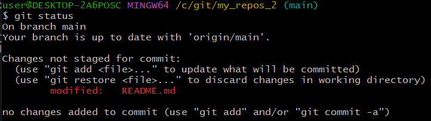

1. Посмотрите изменения в файле README.md, выполнив команды `git diff` и `git diff --staged`.

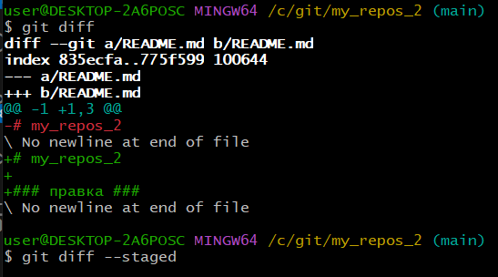


1. Переведите файл в состояние staged или, как говорят, добавьте файл в коммит, командой `git add README.md`.

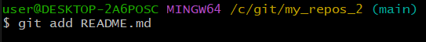

1. Ещё раз выполните команды `git diff` и `git diff --staged`.

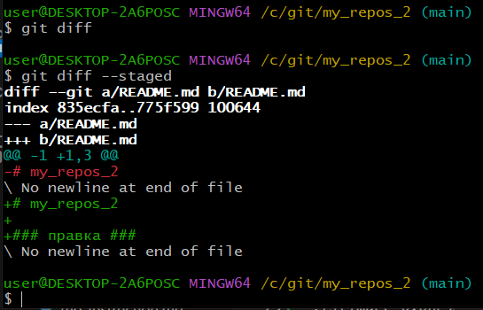

1. Теперь можно сделать коммит `git commit -m 'First commit'`.

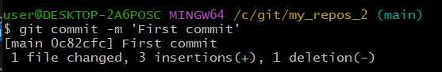

1. Сделайте `git push origin master`.

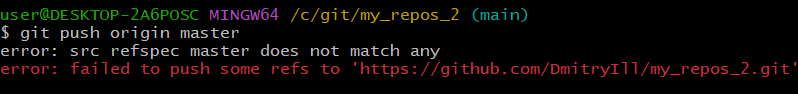

`ветки master нет, но, есть ветка main:`

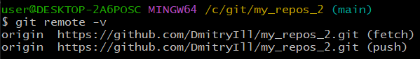

`скорректировал:`

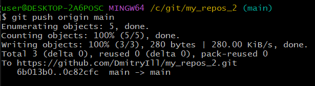

В качестве ответа добавьте ссылку на этот коммит в ваш md-файл с решением.

```
код коммита:
0c82cfcc367bab700c853a3db0f8f32b7c34ebaf
```
https://github.com/DmitryIll/my_repos_2/commit/0c82cfcc367bab700c853a3db0f8f32b7c34ebaf

---

### Задание 2


`Приведите ответ в свободной форме........`

1. `Заполните здесь этапы выполнения, если требуется ....`
2. `Заполните здесь этапы выполнения, если требуется ....`
3. `Заполните здесь этапы выполнения, если требуется ....`
4. `Заполните здесь этапы выполнения, если требуется ....`
5. `Заполните здесь этапы выполнения, если требуется ....`
6. 

```
Поле для вставки кода...
....
....
....
....
```

`При необходимости прикрепитe сюда скриншоты
`


---

### Задание 3

`Приведите ответ в свободной форме........`

1. `Заполните здесь этапы выполнения, если требуется ....`
2. `Заполните здесь этапы выполнения, если требуется ....`
3. `Заполните здесь этапы выполнения, если требуется ....`
4. `Заполните здесь этапы выполнения, если требуется ....`
5. `Заполните здесь этапы выполнения, если требуется ....`
6. 

```
Поле для вставки кода...
....
....
....
....
```

`При необходимости прикрепитe сюда скриншоты
`

### Задание 4

`Приведите ответ в свободной форме........`

1. `Заполните здесь этапы выполнения, если требуется ....`
2. `Заполните здесь этапы выполнения, если требуется ....`
3. `Заполните здесь этапы выполнения, если требуется ....`
4. `Заполните здесь этапы выполнения, если требуется ....`
5. `Заполните здесь этапы выполнения, если требуется ....`
6. 

```
Поле для вставки кода...
....
....
....
....
```

`При необходимости прикрепитe сюда скриншоты
`

---
## Дополнительные задания (со звездочкой*)

Эти задания дополнительные (не обязательные к выполнению) и никак не повлияют на получение вами зачета по этому домашнему заданию. Вы можете их выполнить, если хотите глубже и/или шире разобраться в материале.

### Задание 5

`Приведите ответ в свободной форме........`

1. `Заполните здесь этапы выполнения, если требуется ....`
2. `Заполните здесь этапы выполнения, если требуется ....`
3. `Заполните здесь этапы выполнения, если требуется ....`
4. `Заполните здесь этапы выполнения, если требуется ....`
5. `Заполните здесь этапы выполнения, если требуется ....`
6. 

`При необходимости прикрепитe сюда скриншоты
`
